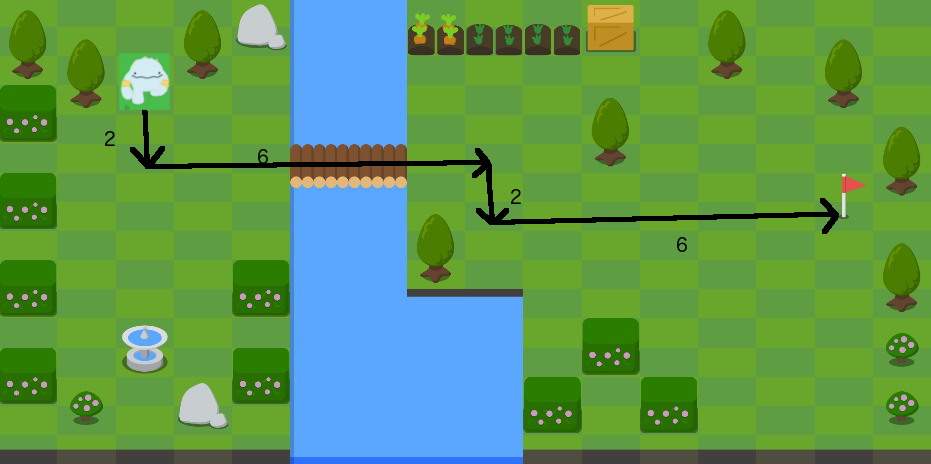
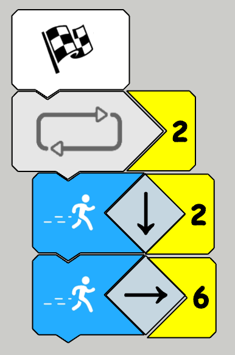
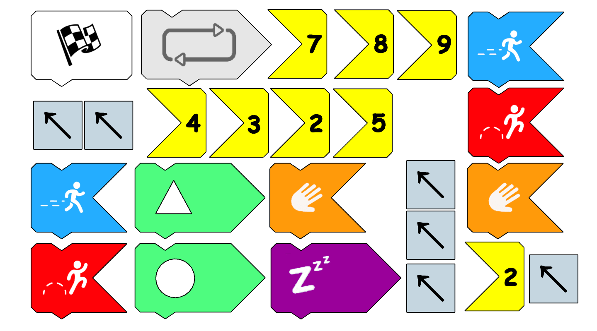

# Ory
Inspirado pela comunidade aberta 'ScratchJr' (https://www.scratchjr.org/) e o incrível produto 'Osmo Coding' (https://www.playosmo.com/en/coding/), Ory é um projeto de jogo educativo interativo de lógica e introdução a programação para crianças, utilizando um ambiente lúdico e uma linguagem baseada em bloquinhos físicos de encaixar.

> É um projeto sem fins lucrativos, de baixo custo de implantação e acessível mesmo para escolas e crianças com recursos bastante limitados.

## Objetivo do projeto

O projeto visa conseguir disponibilizar uma experiência similar ao '[Osmo coding](https://www.youtube.com/watch?v=I9Qm18it47A)' para as crianças em uma sala de aula, mesmo com apenas 1 dispositivo android: 

* Todas as crianças poderão ver seu robô interpretando os bloquinhos mesmo que projetado na lousa digital, smart Tv, ou cada um com seu próprio tablet, ou ainda um celular.

* Elaborar workshops que ocorrerão com educadores, incluindo desde a confecção das peças, baixar o software e colocar para rodar, e dar uma aula completa para as crianças.

## Como funciona?
* A cada nível, um desafio é proposto. Por exemplo, fazer o personagem chegar na bandeirinha vermelha.

* As crianças deverão montar uma sequência de peças para fazer seu robô chegar na bandeira conforme a imagem abaixo.

* As peças podem ser impressas em papel, papel magnético ou EVA na própria escola.

* Qualquer um poderá baixar o software (open source), recortar as peças e colocar as crianças para brincar.

* As peças poderão ser criadas pelos professores com os mais variados desafios e novas peças poderão ser adicionadas conforme a evolução do projeto.

* Capture com a câmera a solução de cada criança a ser executada para ver se ela acertou o desafio.

* Então o `personagem` no jogo realizará as ações programadas pela sequência de peças como a criança montou.

## O que está por trás do Ory?

Basicamente utilizamos Deep Learning para fazer o computador entender a imagem dos bloquinhos que as crianças devem montar e simulamos os movimentos com o `player` em um ambiente lúdico (atualmente utilizando o framework Phazer)

# Contribua

O projeto atualmente se encontra em fase inicial de desenvolvimento e precisa de apoio em várias frentes:

* Solicitações de features e correções de bugs através das `ISSUES` no github
* Pull Requests são muito bem vindos.
* Participe do nosso grupo do telegram: https://t.me/joinchat/Hu97gRuesCizleuWnnLa0Q
